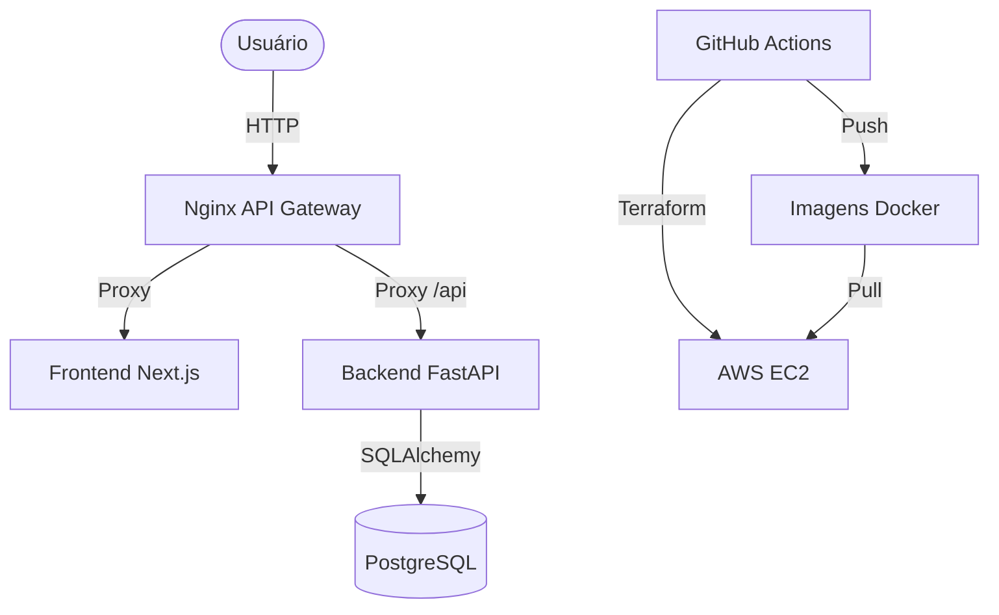

# 📝 Task Manager

API REST de gerenciamento de tarefas com autenticação JWT, frontend em Next.js e pipeline de CI/CD automatizado para AWS com configuração zero.

---


---

## 📌 Índice
- [🚀 Stack Tecnológica](#-stack-tecnológica)
- [🧩 Parte 1 - Lógica e Fundamentos](#-parte-1---lógica-e-fundamentos)
- [⚙️ Parte 2 - Backend](#-parte-2---backend)
- [💻 Parte 3 - Frontend](#-parte-3---frontend)
- [🛠️ Parte 4 - Integração e Qualidade](#-parte-4---integração-e-qualidade)

---

## 🚀 Stack Tecnológica

| Camada         | Tecnologia                                      |
|----------------|-------------------------------------------------|
| **Backend**    |   |
| **Frontend**   |   |
| **Database**   |   |
| **DevOps**     |   |
| **CI/CD**      |  |
| **Proxy**      |  |

## 📋 Pré-requisitos

- ✅ **Docker e Docker Compose** instalados.
- ☁️ **Conta AWS** (apenas para o deploy em produção).

---

## 🧩 Parte 1 - Lógica e Fundamentos

### 1️⃣ Lógica
Implementação da função que recebe uma lista de números inteiros e retorna a soma dos pares e a média dos ímpares, ignorando valores inválidos.

**Algoritmo:**
```typescript
function analisarNumeros(dados: any[]): { somaPares: number; mediaImpares: number | null } {
  // Filtra apenas números inteiros, ignorando booleanos e outros tipos
  const inteiros = dados.filter(x => typeof x === 'number' && Number.isInteger(x));
  
  // Separa pares e ímpares
  const pares = inteiros.filter(x => x % 2 === 0);
  const impares = inteiros.filter(x => x % 2 !== 0);
  
  // Calcula a soma dos pares
  const somaPares = pares.reduce((acc, curr) => acc + curr, 0);
  
  // Calcula a média dos ímpares (retorna null se não houver ímpares)
  const mediaImpares = impares.length > 0 
    ? impares.reduce((acc, curr) => acc + curr, 0) / impares.length 
    : null;
    
  return { somaPares, mediaImpares };
}
```

---

### 2️⃣ Conceitos

**2.1 REST vs GraphQL:** REST usa endpoints fixos; GraphQL permite consultas flexíveis pelo cliente.
**2.2 Transação:** Unidade de trabalho atômica que garante integridade (ACID).
**2.3 Autenticação vs Autorização:** Autenticação é identidade (Quem é?); Autorização é permissão (O que pode fazer?).
**2.4 Cache:** Usar para dados caros/estáticos; evitar para dados sensíveis ou de alta volatilidade.

---

## ⚙️ Parte 2 - Backend

### 📡 Endpoints da API

| Método | Rota                         | Descrição                           | Auth? |
|--------|------------------------------|-------------------------------------|-------|
| GET    | /api/health                  | Health check                        | Não   |
| POST   | /api/v1/auth/register        | Cadastro de usuário                 | Não   |
| POST   | /api/v1/auth/login           | Login (retorna JWT)                 | Não   |
| POST   | /api/v1/tasks/               | Criar tarefa                        | Sim   |
| GET    | /api/v1/tasks/               | Listar tarefas (paginado, filtrado) | Sim   |
| GET    | /api/v1/tasks/{id}           | Buscar tarefa por ID                | Sim   |
| PUT    | /api/v1/tasks/{id}           | Atualizar tarefa                    | Sim   |
| DELETE | /api/v1/tasks/{id}           | Deletar tarefa                      | Sim   |
| POST   | /api/v1/tasks/{id}/toggle    | Alternar status (Pendente/Concluída)| Sim   |

### 🧪 Testes
```bash
make test
# Ou manualmente:
cd backend && export PYTHONPATH=$PYTHONPATH:. && ./venv/bin/pytest --cov=app tests/ -v
```

**Cobertura Mínima:** 80% (Configurado em `pytest.ini`)

### 📄 Paginação e Filtros
(Implementado como diferencial)

A listagem de tarefas suporta paginação e filtros via query parameters:
`GET /api/v1/tasks/?page=1&page_size=10&status=completed`

Exemplo de resposta:
```json
{
  "items": [...],
  "total": 15,
  "page": 1,
  "page_size": 10
}
```

---

## 💻 Parte 3 - Frontend

A interface foi construída com **Next.js 16 (App Router)** e **Tailwind CSS 4**.

- 🔄 **Gerenciamento de Estado:** Utiliza React Hooks (`useState`, `useEffect`, `useCallback`) para controle de tarefas e autenticação.
- ⚡ **SSR & Client Components:** Renderização no servidor para performance inicial e componentes interativos no cliente.
- 📱 **Responsividade:** Layout adaptável para dispositivos móveis e desktop.
- 🔔 **Feedback:** Loading states e tratamento de erros amigável com Toasts.
- 🧪 **Testes Unitários:** Implementados com **Vitest** e **React Testing Library**, com cobertura mínima de **60%**.

---

## 🛠️ Parte 4 - Integração e Qualidade

### 🏠 Desenvolvimento Local (Zero-Config) ⚡
1.  **Inicie o ambiente:**
    ```bash
    make dev
    ```
2.  **O que acontece automaticamente:**
    - O banco PostgreSQL é iniciado.
    - O backend aguarda o banco estar saudável.
    - **Alembic** executa as migrações para criar o esquema.
    - **Seeding** popula o banco com usuários e tarefas de teste (dev padrão).
    - **Hot Reload:** O ambiente monitora mudanças no código do backend e frontend, reiniciando os containers automaticamente para refletir as alterações instantaneamente.

- Frontend: [http://localhost](http://localhost) | API Docs: [http://localhost/api/docs](http://localhost/api/docs)

### ☁️ Deploy em Produção (AWS) 🚀
O deploy exige apenas **duas** configurações no GitHub (Secrets):
1. `AWS_ACCESS_KEY_ID`
2. `AWS_SECRET_ACCESS_KEY`

O Terraform cuidará da criação da chave SSH, do Security Group e da instância. O pipeline injetará automaticamente o IP e gerará os segredos necessários.
O pipeline de CI/CD monitora o repositório e, a cada push na branch principal, reconstrói e atualiza os containers na AWS automaticamente.

### 🔐 Configuração e Variáveis

Embora o projeto use *fallbacks* automáticos, você pode sobrescrever qualquer comportamento via variáveis de ambiente no `.env` (local) ou GitHub Secrets (produção). A tabela abaixo lista todas as variáveis de ambiente utilizadas no projeto, seus fallbacks e onde cada uma é aplicada:

| Variável | Onde é usada | Fallback (Dev) / Default | Descrição |
| :--- | :--- | :--- | :--- |
| `ENVIRONMENT` | Backend | `development` | Define o modo de execução da aplicação (e.g., `development`, `production`). |
| `POSTGRES_USER` | DB, Backend | `user` | Usuário para conexão com o banco de dados PostgreSQL. |
| `POSTGRES_PASSWORD` | DB, Backend | `password` | Senha para conexão com o banco de dados PostgreSQL. |
| `POSTGRES_DB` | DB, Backend | `taskdb` | Nome do banco de dados PostgreSQL. |
| `DATABASE_URL` | Backend | `postgresql://user:password@db:5432/taskdb` | URL completa de conexão com o banco de dados. Construída a partir das variáveis `POSTGRES_USER`, `POSTGRES_PASSWORD`, `POSTGRES_DB` e o host `db` no Docker Compose. |
| `JWT_SECRET` | Backend | `dev-secret-key-change-in-production` | Chave secreta utilizada para assinar e verificar os JSON Web Tokens (JWTs). **Essencial para segurança em produção.** |
| `JWT_EXPIRE_MINUTES` | Backend | `60` | Duração de validade do Access Token JWT em minutos. |
| `JWT_REFRESH_EXPIRE_DAYS`| Backend | `7` | Duração de validade do Refresh Token JWT em dias. |
| `CORS_ORIGINS` | Backend | `*` | Lista de origens permitidas para requisições Cross-Origin Resource Sharing (CORS). Use `*` para permitir todas (apenas em dev). |
| `SEED_DB` | Backend, Docker Compose | `true` (dev), `false` (prod) | Controla se o script de população de dados de teste deve ser executado na inicialização do backend. |
| `NEXT_PUBLIC_API_URL` | Frontend | `http://localhost/api/v1` | URL base da API para requisições feitas pelo frontend no navegador (client-side). |
| `INTERNAL_API_URL` | Frontend | `http://backend:8000/api/v1` | URL base da API para requisições feitas pelo frontend no servidor (server-side rendering - SSR). |
| `DOCKER_USERNAME` | CI/CD, `.env.example` | `your-dockerhub-username` | (Apenas no `.env.example`) Nome de usuário do Docker Hub ou GitHub Container Registry, usado para construir o nome da imagem. |
| `DOCKER_IMAGE_BASE` | CI/CD, Docker Compose (Prod) | `ghcr.io/username` | Base do nome da imagem Docker no registro de containers (e.g., `ghcr.io/your-org`). |
| `IMAGE_TAG` | CI/CD, Docker Compose (Prod) | `latest` | Tag da imagem Docker a ser utilizada para o deploy. |
| `WATCHPACK_POLLING` | Backend (Dev), Frontend (Dev) | `true` | Habilita o modo de polling para detecção de mudanças de arquivos em volumes Docker, útil em alguns ambientes Linux/WSL. |
| `CHOKIDAR_USEPOLLING` | Frontend (Dev) | `true` | Habilita o modo de polling para o `chokidar` (usado pelo Next.js) para detecção de mudanças de arquivos em volumes Docker. |

### ⌨️ Comandos Makefile
- `make dev`: Sobe tudo (Migrate + Seed inclusos).
- `make test`: Executa testes unitários com cobertura (Backend + Frontend).
- `make seed`: Força a execução do script de população de dados.
- `make migrate`: Aplica migrações pendentes manualmente.

---

### 🏗️ Arquitetura



### 💡 Decisões Técnicas

- **Filosofia Zero-Config:** Adoção de um padrão de configuração mínima, tanto para desenvolvimento local quanto para deploy em produção. Isso inclui fallbacks inteligentes para variáveis de ambiente no `docker-compose`, auto-geração de chaves SSH e segredos, e detecção automática de URLs de API no pipeline de CI/CD. O objetivo é reduzir o atrito e a complexidade, permitindo que o desenvolvedor se concentre no código da aplicação.
- **Arquitetura Base (Backend):** Uso de **BaseService** e **BaseRepository** genéricos. Essa abstração centraliza lógica repetitiva de CRUD, garante tratamento de erros padronizado (como `get_or_404`) e facilita a implementação de multi-tenancy através de métodos "scoped" que exigem sempre o `owner_id`.
- **Padrão Repository + Service:** Separação clara de responsabilidades. O Repository lida exclusivamente com consultas SQLAlchemy, enquanto o Service gerencia regras de negócio e transações, mantendo os Controllers (Routers) focados apenas na interface HTTP.
- **FastAPI (Pydantic v2) & Injeção de Dependência:** Escolhido pela performance assíncrona, documentação automática (Swagger/OpenAPI) e validação rigorosa. Utiliza padrões modernos de `Annotated` para injeção de dependência, garantindo um código limpo, testável e desacoplado.
- **API Orientada a Ações:** Além do CRUD tradicional, a API implementa endpoints específicos para ações de negócio (como `toggle_task`), reduzindo o número de requisições e a complexidade lógica no frontend.
- **Gerenciamento de Estado Híbrido (Frontend):** 
  - **React Query:** Gerencia o estado do servidor, cache e sincronização, eliminando a necessidade de `useEffect` complexos para busca de dados.
  - **Zustand:** Gerencia o estado global UI (autenticação, preferências) de forma leve e performática.
- **Migrations com Alembic:** Controle de versão do esquema do banco de dados, permitindo evoluções seguras e reprodutíveis entre ambientes de desenvolvimento, teste e produção.
- **Next.js App Router & React 19:** Aproveitamento das últimas tecnologias do ecossistema React, incluindo *Server Components* para performance e as melhorias de renderização do React 19 e Tailwind CSS 4.
- **CI/CD com GitHub Actions & Terraform:** Automação completa do ciclo de vida da aplicação, desde a criação da infraestrutura na AWS até o deploy contínuo, garantindo que o ambiente de produção seja sempre um reflexo fiel do código aprovado.

### 🛡️ Recursos de Segurança

- **Tokens de Atualização (Refresh Tokens) com Rotação**: Implementação de *Refresh Token Rotation*. Ao solicitar um novo *Access Token*, o *Refresh Token* antigo é revogado e um novo é emitido, mitigando riscos de interceptação.
- **Assuntos de JWT Imutáveis**: O campo `sub` do JWT contém o UUID do usuário, garantindo que mudanças de e-mail ou username não invalidem a sessão ou causem inconsistências.
- **UUIDs como Chave Primária**: Uso de UUID v4 em vez de IDs sequenciais para evitar enumeração de recursos e aumentar a segurança.
- **Segurança com JWT + Argon2**: Uso do algoritmo **Argon2** (vencedor do Password Hashing Competition) via `pwdlib` para hashing de senhas, oferecendo proteção superior contra ataques de GPU e *side-channel*.
- **Defesa em Profundidade**: Validação tripla: Banco de Dados (Constraints), API (Pydantic v2) e Frontend (Zod + React Hook Form).

### 🚀 O que Melhoraria com Mais Tempo

- **Visualização Kanban:** Implementação de um quadro Kanban no frontend para proporcionar uma gestão visual do fluxo de trabalho.
- **Categorização e Projetos:** Criação de uma forma de organizar tarefas por projeto, categoria ou tópicos (tags).
- **Testes de Integração e E2E:** Ampliação da cobertura com testes de integração no backend e testes de ponta a ponta (E2E) com **Playwright**.
- **Infraestrutura e Segurança:** Desacoplamento do banco de dados para um serviço gerenciado, configuração de **SSL/TLS** e uso de domínio customizado.
- **Múltiplos Ambientes:** Estruturação de ambientes distintos (pelo menos um de Desenvolvimento/Dev e outro de Produção) via Terraform, incluindo a configuração de um **Backend Remoto (S3 + DynamoDB)** para garantir o bloqueio de estado (*state locking*) em produção.
- **Observabilidade:** Implementação de **Logs Estruturados** e centralização de logs para melhor monitoramento e depuração.
- **Rate Limiting** para proteger endpoints sensíveis contra ataques de força bruta.
- **Soft Delete** nas tarefas para permitir a recuperação de dados excluídos acidentalmente.
- **Camada de Cache** com **Redis** para otimizar a performance de consultas frequentes.

### 🏆 Pontos Fortes e Limitações

**Pontos fortes:**
- **Robustez Arquitetural:** Uso de padrões profissionais (Repository/Service, Base Classes) que facilitam a manutenção e escalabilidade.
- **Segurança Avançada:** Implementação de Argon2, Refresh Token Rotation e isolamento de dados por usuário (Multi-tenancy).
- **Tipagem End-to-End:** Uso extensivo de TypeScript no Frontend e Pydantic no Backend, garantindo contratos de API sólidos.
- **UX Fluida (Optimistic Updates):** Implementação de **Optimistic Updates** via React Query, permitindo que a interface responda instantaneamente às ações do usuário enquanto a sincronização ocorre em background.
- **Arquitetura de Componentes UI:** Separação rigorosa entre componentes de interface (UI) e lógica de negócio, utilizando componentes altamente desacoplados, reutilizáveis e baseados em Radix UI.
- **Internacionalização (i18n) Nativa:** Suporte completo a múltiplos idiomas (PT/EN) com detecção automática, demonstrando prontidão para o mercado global.
- **Gateway de API com Nginx:** Centralização de requisições, compressão Gzip e configuração otimizada para performance e segurança na borda.
- **DevEx Superior com Makefile:** Ambiente totalmente dockerizado com um **Makefile** que centraliza todos os comandos essenciais (build, dev, test, migrate, seed), simplificando o fluxo de trabalho.
- **Qualidade Assegurada no CI/CD:** O pipeline de CI/CD impõe padrões rigorosos de qualidade, executando obrigatoriamente testes com cobertura mínima (**80% no Backend**, **60% no Frontend**) e ferramentas de linting como **Ruff** (Backend) e ESLint (Frontend) antes de qualquer deploy.
- **Automação de Infraestrutura:** Uso de **Terraform** para provisionamento reprodutível de recursos na AWS.
- **UX Consistente:** Tratamento global de erros, estados de carregamento (Skeleton/Spinners) e feedbacks via Toast.

**Limitações:**
- **Single Point of Failure (DB):** No estágio atual, o banco de dados roda em container na mesma EC2 (melhoraria com RDS).
- **SSL/TLS Externo:** O HTTPS não está configurado nativamente no Nginx do projeto (requer Certbot ou Load Balancer).
- **Ausência de Cache Distribuído:** Consultas repetitivas batem sempre no DB (melhoraria com Redis).
- **Observabilidade Limitada:** Logs são gerenciados pelo Docker; falta centralização em serviços como CloudWatch ou ELK.
- **Ausência de Testes de Integração e E2E:** O projeto conta atualmente apenas com testes unitários, o que representa uma limitação na validação de fluxos completos de ponta a ponta e integrações complexas.