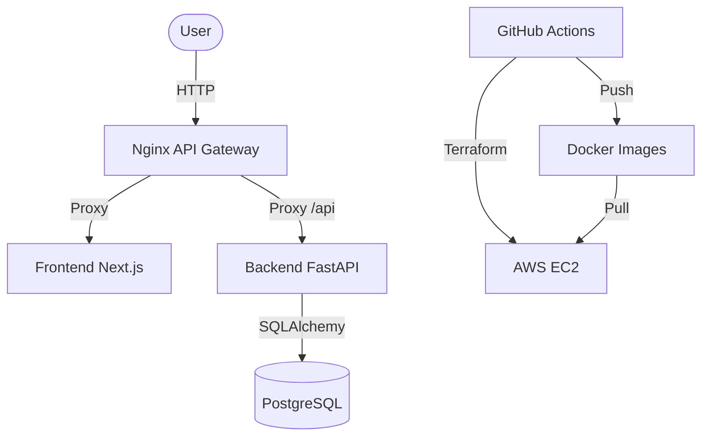

# 📝 Task Manager

REST API for task management with JWT authentication, Next.js frontend, and automated CI/CD pipeline to AWS with zero configuration.

---


---

## 📌 Index
- [🚀 Tech Stack](#-tech-stack)
- [📋 Prerequisites](#-prerequisites)
- [⚙️ Backend](#-backend)
- [💻 Frontend](#-frontend)
- [🛠️ Integration and Quality](#-integration-and-quality)
- [🔐 Configuration and Variables](#-configuration-and-variables)
- [⌨️ Makefile Commands](#-makefile-commands)
- [🏗️ Architecture](#-architecture)
- [💡 Technical Decisions](#-technical-decisions)
- [🛡️ Security Features](#-security-features)
- [🚀 Future Improvements](#-future-improvements)
- [🏆 Strengths and Limitations](#-strengths-and-limitations)

---

## 🚀 Tech Stack

| Layer          | Technology                                      |
|----------------|-------------------------------------------------|
| **Backend**    |   |
| **Frontend**   |   |
| **Database**   |   |
| **DevOps**     |   |
| **CI/CD**      |  |
| **Proxy**      |  |

## 📋 Prerequisites

- ✅ **Docker and Docker Compose** installed.
- ☁️ **AWS Account** (only for production deployment).

---

## ⚙️ Backend

### 📡 API Endpoints

| Method | Route                        | Description                         | Auth? |
|--------|------------------------------|-------------------------------------|-------|
| GET    | /api/health                  | Health check                        | No    |
| POST   | /api/v1/auth/register        | User registration                   | No    |
| POST   | /api/v1/auth/login           | Login (returns JWT)                 | No    |
| POST   | /api/v1/tasks/               | Create task                         | Yes   |
| GET    | /api/v1/tasks/               | List tasks (paginated, filtered)    | Yes   |
| GET    | /api/v1/tasks/{id}           | Get task by ID                      | Yes   |
| PUT    | /api/v1/tasks/{id}           | Update task                         | Yes   |
| PATCH  | /api/v1/tasks/{id}/status    | Update status                       | Yes   |
| DELETE | /api/v1/tasks/{id}           | Delete task                         | Yes   |

### 🧪 Tests
```bash
make test
# Or manually:
cd backend && export PYTHONPATH=$PYTHONPATH:. && ./venv/bin/pytest --cov=app tests/ -v
```

**Minimum Coverage:** 80% (Configured in `pytest.ini`)

### 📄 Pagination and Filters

Task listing supports pagination and filters via query parameters:
`GET /api/v1/tasks/?page=1&page_size=10&status=completed`

Example response:
```json
{
  "items": [...],
  "total": 15,
  "page": 1,
  "page_size": 10
}
```

---

## 💻 Frontend

The interface was built with **Next.js 16 (App Router)** and **Tailwind CSS 4**.

- 🔄 **State Management:** Uses React Hooks (`useState`, `useEffect`, `useCallback`) for task and authentication control.
- ⚡ **SSR & Client Components:** Server-side rendering for initial performance and interactive client components.
- 📱 **Responsiveness:** Adaptive layout for mobile and desktop devices.
- 🔔 **Feedback:** Loading states and user-friendly error handling with Toasts.
- 🧪 **Unit Tests:** Implemented with **Vitest** and **React Testing Library**, with a minimum coverage of **60%**.

---

## 🛠️ Integration and Quality

### 🏠 Local Development (Zero-Config) ⚡
1.  **Start the environment:**
    ```bash
    make dev
    ```
2.  **What happens automatically:**
    - The PostgreSQL database is started.
    - The backend waits for the database to be healthy.
    - **Alembic** executes migrations to create the schema.
    - **Seeding** populates the database with test users and tasks (default dev).
    - **Hot Reload:** The environment monitors changes in the backend and frontend code, automatically restarting containers to instantly reflect changes.

- Frontend: [http://localhost](http://localhost) | API Docs: [http://localhost/api/docs](http://localhost/api/docs)

### ☁️ Production Deployment (AWS) 🚀
Deployment requires only **two** GitHub (Secrets) configurations:
1. `AWS_ACCESS_KEY_ID`
2. `AWS_SECRET_ACCESS_KEY`

Terraform will handle the creation of AWS infrastructure, including the EC2 instance, Security Groups, and SSH keys. To ensure the application's public IP address remains constant even after instance recreation, an **Elastic IP (EIP)** is provisioned and associated with the EC2 instance.

The project uses **Terraform Remote State** stored in an S3 bucket. This ensures that the infrastructure state is persistent across pipeline executions, allowing for incremental and secure updates, similar to AWS CloudFormation behavior.

### 🔐 Configuration and Variables

Although the project uses automatic *fallbacks*, you can override any behavior via environment variables in `.env` (local) or GitHub Secrets (production). The table below lists all environment variables used in the project, their fallbacks, and where each is applied:

| Variable | Where used | Fallback (Dev) / Default | Description |
| :--- | :--- | :--- | :--- |
| `ENVIRONMENT` | Backend | `development` | Defines the application's execution mode (e.g., `development`, `production`). |
| `POSTGRES_USER` | DB, Backend | `user` | User for PostgreSQL database connection. |
| `POSTGRES_PASSWORD` | DB, Backend | `password` | Password for PostgreSQL database connection. |
| `POSTGRES_DB` | DB, Backend | `taskdb` | PostgreSQL database name. |
| `DATABASE_URL` | Backend | `postgresql://user:password@db:5432/taskdb` | Full database connection URL. Constructed from `POSTGRES_USER`, `POSTGRES_PASSWORD`, `POSTGRES_DB` variables and the `db` host in Docker Compose. |
| `JWT_SECRET` | Backend | `dev-secret-key-change-in-production` | Secret key used to sign and verify JSON Web Tokens (JWTs). **Essential for production security.** |
| `JWT_EXPIRE_MINUTES` | Backend | `60` | JWT Access Token validity duration in minutes. |
| `JWT_REFRESH_EXPIRE_DAYS`| Backend | `7` | JWT Refresh Token validity duration in days. |
| `CORS_ORIGINS` | Backend | `*` | List of allowed origins for Cross-Origin Resource Sharing (CORS) requests. Use `*` to allow all (dev only). |
| `SEED_DB` | Backend, Docker Compose | `true` (dev), `false` (prod) | Controls whether the test data population script should run on backend startup. |
| `NEXT_PUBLIC_API_URL` | Frontend | `http://localhost/api/v1` | Base API URL for frontend requests in the browser (client-side). |
| `INTERNAL_API_URL` | Frontend | `http://backend:8000/api/v1` | Base API URL for frontend requests on the server (server-side rendering - SSR). |
| `DOCKER_USERNAME` | CI/CD, `.env.example` | `your-dockerhub-username` | (Only in `.env.example`) Docker Hub or GitHub Container Registry username, used to build the image name. |
| `DOCKER_IMAGE_BASE` | CI/CD, Docker Compose (Prod) | `ghcr.io/username` | Base of the Docker image name in the container registry (e.g., `ghcr.io/your-org`). |
| `IMAGE_TAG` | CI/CD, Docker Compose (Prod) | `latest` | Docker image tag to be used for deployment. |
| `WATCHPACK_POLLING` | Backend (Dev), Frontend (Dev) | `true` | Enables polling mode for file change detection in Docker volumes, useful in some Linux/WSL environments. |
| `CHOKIDAR_USEPOLLING` | Frontend (Dev) | `true` | Enables polling mode for `chokidar` (used by Next.js) for file change detection in Docker volumes. |

### ⌨️ Makefile Commands
The project uses a `Makefile` to simplify common development and maintenance tasks:

- `make dev`: Starts the complete development environment (build, containers, migrations, and seed).
- `make down`: Stops all services and removes containers.
- `make test`: Runs the unit test suite (Backend + Frontend) with coverage.
- `make lint`: Runs linting checks on Backend (Ruff), Frontend (ESLint), and Terraform.
- `make migrate`: Applies database migrations via Alembic.
- `make seed`: Populates the database with test users and tasks.
- `make logs`: Displays logs from all containers in real-time.
- `make build`: Forces Docker image rebuild.
- `make shell-be`: Opens an interactive shell inside the Backend container.
- `make shell-fe`: Opens an interactive shell inside the Frontend container.

---

### 🏗️ Architecture



### 💡 Technical Decisions

- **Zero-Config Philosophy:** Adoption of a minimal configuration standard for both local development and production deployment. This includes intelligent fallbacks for environment variables in `docker-compose`, auto-generation of SSH keys and secrets, and automatic API URL detection in the CI/CD pipeline. The goal is to reduce friction and complexity, allowing the developer to focus on the application code.
- **Base Architecture (Backend):** Use of generic **BaseService** and **BaseRepository**. This abstraction centralizes repetitive CRUD logic, ensures standardized error handling (like `get_or_404`), and facilitates multi-tenancy implementation through "scoped" methods that always require `owner_id`.
- **Repository + Service Pattern:** Clear separation of responsibilities. The Repository deals exclusively with SQLAlchemy queries, while the Service manages business rules and transactions, keeping Controllers (Routers) focused only on the HTTP interface.
- **FastAPI (Pydantic v2) & Dependency Injection:** Chosen for asynchronous performance, automatic documentation (Swagger/OpenAPI), and rigorous validation. Uses modern `Annotated` patterns for dependency injection, ensuring clean, testable, and decoupled code.
- **Action-Oriented API:** In addition to traditional CRUD, the API implements specific endpoints for business actions (such as status updates via `PATCH`), reducing network payload and frontend logical complexity by avoiding sending the entire task object for simple changes.
- **Hybrid State Management (Frontend):** 
  - **React Query:** Manages server state, caching, and synchronization, eliminating the need for complex `useEffect` for data fetching.
  - **Zustand:** Manages global UI state (authentication, preferences) in a lightweight and performant way.
- **Migrations with Alembic:** Database schema version control, allowing for safe and reproducible evolutions across development, testing, and production environments.
- **Next.js App Router & React 19:** Leveraging the latest technologies in the React ecosystem, including *Server Components* for performance and the rendering improvements of React 19 and Tailwind CSS 4.
- **CI/CD with GitHub Actions & Terraform:** Complete automation of the application lifecycle, from AWS infrastructure creation to continuous deployment, ensuring that the production environment is always a faithful reflection of approved code.

### 🛡️ Security Features

- **Refresh Tokens with Rotation**: Implementation of *Refresh Token Rotation*. When a new *Access Token* is requested, the old *Refresh Token* is revoked and a new one is issued, mitigating interception risks.
- **Immutable JWT Subjects**: The `sub` field of the JWT contains the user's UUID, ensuring that email or username changes do not invalidate the session or cause inconsistencies.
- **UUIDs as Primary Keys**: Use of UUID v4 instead of sequential IDs to prevent resource enumeration and increase security.
- **JWT Security + Argon2**: Use of the **Argon2** algorithm (winner of the Password Hashing Competition) via `pwdlib` for password hashing, offering superior protection against GPU and *side-channel* attacks.
- **Defense in Depth**: Triple validation: Database (Constraints), API (Pydantic v2) and Frontend (Zod + React Hook Form).

### 🚀 Future Improvements

- **Password Recovery**: Addition of a secure password recovery flow via email.
- **Email Verification**: Implementation of email account verification after registration.
- **Kanban View**: Implementation of a Kanban board in the frontend to provide visual workflow management.
- **Advanced Filters:** Evolve current filters to support multiple selection of status and priorities.
- **DateTimePicker Style:** Refine and standardize the Date Time Picker style to ensure full consistency with the application's design system.
- **Categorization and Projects:** Creation of a way to organize tasks by project, category or topics (tags).
- **Integration and E2E Tests:** Expansion of coverage with backend integration tests and end-to-end (E2E) tests with **Playwright**.
- **Infrastructure and Security:** Decoupling the database to a managed service, **SSL/TLS** configuration, and use of a custom domain.
- **Multiple Environments:** Structuring distinct environments (at least one Development/Dev and one Production) via Terraform.
- **Observability:** Implementation of **Structured Logs** and log centralization for better monitoring and debugging.
- **Rate Limiting** to protect sensitive endpoints against brute-force attacks.
- **Soft Delete** on tasks to allow recovery of accidentally deleted data.
- **Caching Layer** with **Redis** to optimize the performance of frequent queries.
- **Conditional Deployment:** Implement logic in the CI/CD pipeline to skip steps (e.g., Docker image rebuild or deployment) if only specific parts of the code (e.g., only `README.md` or documentation files) are changed, optimizing execution time.

### 🏆 Strengths and Limitations

**Strengths:**
- **Architectural Robustness:** Use of professional patterns (Repository/Service, Base Classes) that facilitate maintenance and scalability.
- **Advanced Security:** Implementation of Argon2, Refresh Token Rotation, and user data isolation (Multi-tenancy).
- **End-to-End Typing:** Extensive use of TypeScript in the Frontend and Pydantic in the Backend, ensuring solid API contracts.
- **Fluid UX (Optimistic Updates):** Implementation of **Optimistic Updates** via React Query, allowing the interface to respond instantly to user actions while synchronization occurs in the background.
- **UI Component Architecture:** Strict separation between UI components and business logic, using highly decoupled, reusable components based on Radix UI.
- **Native Internationalization (i18n):** Full support for multiple languages (PT/EN) with automatic detection, demonstrating readiness for the global market.
- **API Gateway with Nginx:** Centralization of requests, Gzip compression, and optimized configuration for performance and security at the edge.
- **Superior DevEx with Makefile:** Fully containerized environment with a **Makefile** that centralizes all essential commands (build, dev, test, migrate, seed), simplifying the workflow.
- **Quality Assurance in CI/CD:** The CI/CD pipeline enforces rigorous quality standards, obligatorily executing tests with minimum coverage (**80% in Backend**, **60% in Frontend**) and linting tools like **Ruff** (Backend) and ESLint (Frontend) before any deployment.
- **Infrastructure Automation:** Use of **Terraform** for reproducible provisioning of AWS resources, now with **Remote State in S3** and **Elastic IP (EIP)** for greater security and stability.
- **Consistent UX:** Global error handling, loading states (Skeleton/Spinners), and feedback via Toast.

**Limitations:**
- **Single Point of Failure (DB):** In the current stage, the database runs in a container on the same EC2 instance (would improve with RDS).
- **External SSL/TLS:** HTTPS is not natively configured in the project's Nginx (requires Certbot or Load Balancer).
- **Absence of Distributed Cache:** Repetitive queries always hit the DB (would improve with Redis).
- **Limited Observability:** Logs are managed by Docker; centralization in services like CloudWatch or ELK is missing.
- **Absence of Integration and E2E Tests:** The project currently relies only on unit tests, which represents a limitation in validating complete end-to-end flows and complex integrations.
- **Frontend Test Coverage:** The current unit test coverage in the frontend is **60%**, which represents a point of attention and an opportunity for improvement to ensure greater stability.